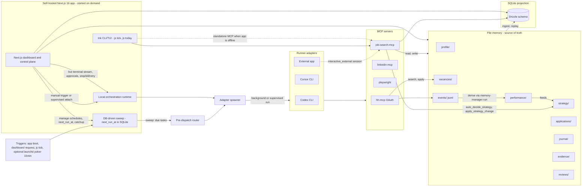

# Architecture Diagram

End-to-end dataflow: agents call MCP servers; `job-search` MCP is the sole write path into memory and DB; file memory is the source of truth; SQLite is a projection.

```mermaid
flowchart LR
    subgraph adapters [Runner adapters]
        codex[Codex CLI]
        cursor[Cursor CLI]
        ext[External app]
    end

    subgraph mcp [MCP servers]
        hhmcp[hh-mcp OAuth]
        lmcp[linkedin-mcp]
        pwmcp[playwright]
        jsmcp[job-search-mcp]
    end

    subgraph memory [File memory - source of truth]
        profile[profile/]
        strategy[strategy/]
        vacancies[vacancies/]
        applications[applications/]
        events[events/ jsonl]
        journal[journal/]
        evidence[evidence/]
        perf[performance/]
        reviews[reviews/]
    end

    subgraph db [SQLite projection]
        sqlite[(Drizzle schema)]
    end

    subgraph app [Self-hosted Next.js 16 app - started on demand]
        web[Next.js dashboard and control plane]
        sched[DB-driven sweep - next_run_at in SQLite]
        cli[Ink CLI/TUI - js tick, js today]
        orch[Local orchestration runtime]
    end

    triggers["Triggers: app boot, dashboard request, js tick, optional launchd poker 15min"] --> sched
    sched -->|"sweep: due tasks"| route[Pre-dispatch router]
    route --> spawn[Adapter spawner]
    web -->|"manual trigger or supervised attach"| orch
    orch --> spawn
    spawn -->|"background or supervised run"| adapters
    ext -.->|"interactive_external session"| jsmcp
    adapters --> mcp
    hhmcp -->|"search, apply"| vacancies
    hhmcp --> events
    jsmcp -->|"read, write"| memory
    jsmcp --> sqlite
    jsmcp -->|"auto_decide_strategy, apply_strategy_change"| strategy
    memory -->|"ingest, replay"| sqlite
    web --> sqlite
    web --> memory
    web -->|"manage schedules, next_run_at, catchup"| sched
    web -->|"live terminal stream, approvals, stop/kill/retry"| orch
    cli --> jsmcp
    cli -.->|"standalone MCP when app is offline"| jsmcp
    events -->|"derive via memory-manager run"| perf
    perf -->|"feeds"| strategy
```
