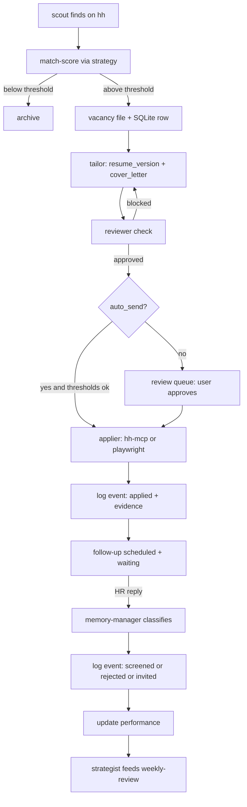

# Vacancy Lifecycle

Life of a single vacancy from scout to updated performance.

```mermaid
flowchart TD
    S1[scout finds on hh] --> S2[match-score via strategy]
    S2 -->|below threshold| Drop[archive]
    S2 -->|above threshold| V[vacancy file + SQLite row]
    V --> T[tailor: resume_version + cover_letter]
    T --> R[reviewer check]
    R -->|blocked| T
    R -->|approved| A{auto_send?}
    A -->|no| Q[review queue: user approves]
    A -->|yes and thresholds ok| AP[applier: hh-mcp or playwright]
    Q --> AP
    AP --> EV[log event: applied + evidence]
    EV --> FU[follow-up scheduled + waiting]
    FU -->|HR reply| MM[memory-manager classifies]
    MM --> LE[log event: screened or rejected or invited]
    LE --> UP[update performance]
    UP --> ST[strategist feeds weekly-review]
```
